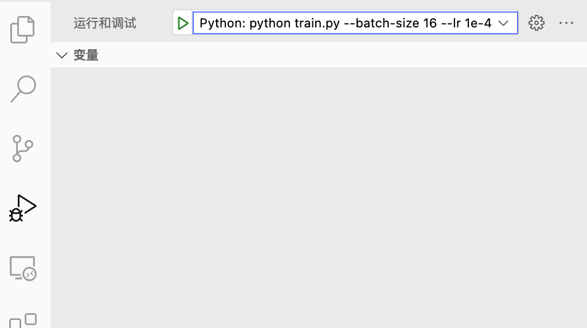

# VPDB
> Python debug configuration generator for vscode

## Install

```shell script
pip install vpdb
```

## Command Line Tools

### vpdb 
VSCode debug configuration generator from a python command line.

It can automatically generate the debug configuration file for vscode by just adding `vpdb` in front of your python command.
It will parse the environment variables and the arguments list correctly.

For example:
```shell
vpdb CUDA_VISIBLE_DEVICES=1,2 python train.py --batch-size 16 --lr 1e-4
```

It will generate the debug configuration in `.vscode/launch.json`. 
Then you can debug your python file by clicking the corresponding button.

```json
{
    "version": "0.2.0",
    "configurations": [
        {
            "name": "Python: python train.py --batch-size 16 --lr 1e-4",
            "type": "python",
            "request": "launch",
            "program": "train.py",
            "env": {
                "CUDA_VISIBLE_DEVICES": "1,2"
            },
            "console": "integratedTerminal",
            "args": [
                "--batch-size",
                "16",
                "--lr",
                "1e-4"
            ],
            "cwd": "/home/xxx/demo_project"
        }
    ]
}
```


> Attention: The vpdb command must be excuted in the root folder of the vscode project.

## TODO

[] Support run file in different directories. 

## Update Log
### 2021.07.08
1. Auto install dependencies for vpdb.
2. Handle the environment variables.